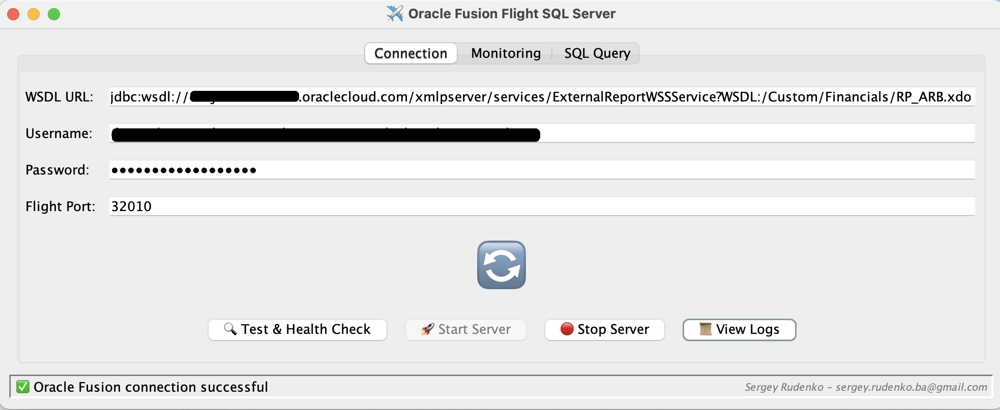
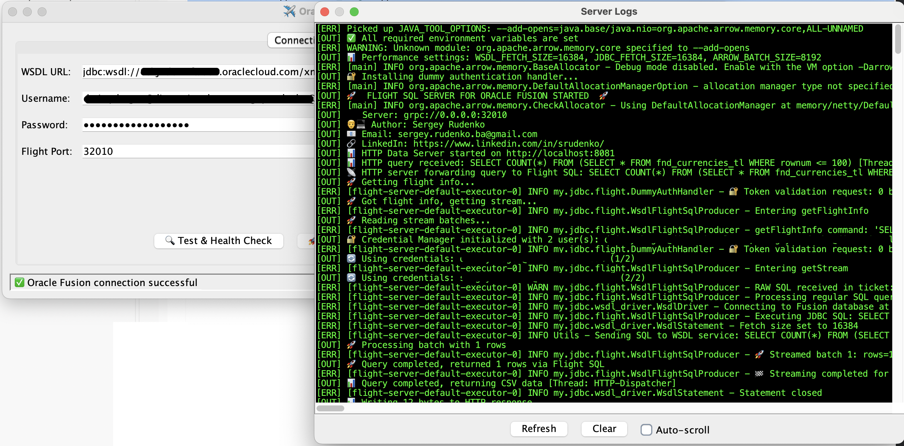

# ✈️ Oracle Fusion Flight SQL Server

**Zero-Infrastructure Data Access for Oracle Fusion**

Transform your Oracle Fusion into a modern data platform with **no servers to manage, no containers to deploy, no infrastructure to maintain**. Download the Windows or macOS installer and start using the app instantly:

🖥️ **Built-in SQL Editor & Export** - Execute ad-hoc SQL queries using the integrated editor with database explorer, syntax highlightings, autocompletion and result previews, export results directly to CSV or Excel with one click.   
✨ **Arrow Flight SQL Protocol** - Connect from Python, R, JavaScript, Go, Rust, and more  
🌐 **HTTP REST API** - Export data with simple curl/wget commands  
📊 **Multiple Export Formats** - CSV, JSON, Excel, and Parquet with hive support  
⚡ **Streaming Data Access** - Handle datasets with automatic pagination   
🎯 **Minimal Configuration** - Just unarchive OTBI report and provide credentials  

IDE   
[](https://youtu.be/jdHffE1RxuA?si=Fmi1jE9S4vfZ1Z4T)

Excel integration   
[](https://www.youtube.com/watch?v=K63LvHCZZwM)

## Why Choose This Over Traditional ETL?

| Traditional ETL              | Oracle Fusion Flight SQL              |
|------------------------------|---------------------------------------|
| Complex infrastructure setup | **Windows & macOS installers**        |
| Multiple servers to manage   | **Zero infrastructure**               |
| Expensive ETL licenses       | **Completely free**                   |
| Vendor lock-in               | **Open standards (Arrow Flight SQL)** |
| Limited export formats       | **CSV, JSON, Excel, Parquet, Hive**   |
| Manual data pipeline setup   | **Instant API access**                |

## 🎯 Well-Suited For

- **Data Scientists** - Direct Python/R access to Oracle Fusion data
- **DevOps Teams** - Simple shell script automation with curl/wget
- **Business Analysts** - One-click Excel exports for reporting
- **Data Engineers** - Parquet exports for data lakes and analytics
- **Integration Teams** - Standards-based API for any programming language
- **ETL Orchestration** - Works seamlessly with Airflow, Prefect, Dagster, and other workflow engines

---

## 📄 Table of Contents

- [✨ Features](#-features)
- [🛠 Prerequisites](#-prerequisites)
- [📝 Installation](#-installation)
- [⚙️ Configuration](#-configuration)
- [❗ Limitations](#-Limitations)
- [⚠️ Important Disclaimer](#-important-disclaimer)
- [📝 TODO](#-todo)
- [📚 Examples](#-examples)
- [🔗 Other ](#-other)
- [📫 Contact](#-contact)

---

## ✨ Features

### 📊 Multi-Format Data Export
- **CSV** - Perfect for spreadsheets and data analysis
- **JSON** - Ideal for web applications and APIs
- **Excel** - Ready-to-use business reports with formatting
- **Parquet** - Optimized columnar format for data lakes and analytics
- **Hive Partitioned** - Partitioned Parquet files in ZIP archive for data lakes

### ⚡ Optimized Data Access
- **Streaming processing** - Handle datasets with memory efficiency
- **Automatic pagination** - Seamless handling of result sets
- **Connection management** - Efficient resource utilization

### 🌐 Dual Protocol Support
- **Arrow Flight SQL** - Modern binary protocol for efficient data transfer
- **HTTP REST API** - Simple endpoints for curl, wget, and web integration
- **Health monitoring** - Built-in health checks and metrics
- **Cross-platform** - Works on Windows and macOS


<!--  -->

<!--  -->


## 🛠 Prerequisites

Before using this server, ensure you have the following:

- **Oracle Fusion Access:** Valid credentials with access to Oracle Fusion reporting.

---

## 📝 Installation & Deployment

### 📦 What You Need

1  **Oracle Fusion credentials** with reporting access   
2  **Download the Windows or macOS installer** from the latest release:

**You're ready to query Oracle Fusion data!** 🎉

   [](https://github.com/krokozyab/ofarrow/releases) <- Download the installer here.


### 🔧 Setup Oracle Fusion Report

1. Create report in OTBI. In your Fusion instance, un-archive DM_ARB.xdm.catalog and RP_ARB.xdo.catalog from [OTBI report](https://github.com/krokozyab/ofarrow/tree/master/otbi) into /Shared Folders/Custom/Financials folder.
2. Install the application by downloading the appropriate installer from the Releases page—available for both Windows and macOS.

## ⚙️ Usage Examples

[### 🐍 Python Data Science](https://gist.github.com/krokozyab/f20b868d4b9c2a1ba12a52e1ada1a07d)

[### 📊 Multi-Format Exports](https://gist.github.com/krokozyab/92e6c977bd3f593f7d39a678a52a57a1)


### 🔍 Health Monitoring
```bash
# Check server health
curl http://localhost:8081/health
# Returns: {"status":"UP","database":"UP","uptime_ms":12345,"response_time_ms":45}
```

[### 🔄 Apache Airflow Integration](https://gist.github.com/krokozyab/69f880e78ca4654faba021c304d48eb0)


### 🗂 Hive Partitioned Export
```bash
# Export data partitioned by a specific column (returns ZIP archive)
curl -G -o gl_partitioned.zip \
  --data-urlencode "sql=SELECT segment1, segment2, segment3, concatenated_segments FROM gl_code_combinations" \
  --data-urlencode "format=hive" \
  --data-urlencode "partition=segment3" \
  "http://localhost:8081/export"
# Extract to see Hive-style directory structure
unzip gl_partitioned.zip
ls -la

```

** Suited for:**
- 🏢 **Data Lakes** - Hive-compatible partitioned structure
- ⚡ **Query Performance** - Partition pruning for faster analytics
- 📁 **Data Organization** - Logical data separation by column values
- 🔄 **ETL Pipelines** - Standard format for Spark, Hive, Presto

---

## 🌐 Server Access Points

Once started, the server provides multiple access methods:

### 📊 Data Export Endpoints
```bash
# CSV Export (default)
curl "http://localhost:8081/export?sql=SELECT * FROM fnd_currencies_tl" -o data.csv

# JSON Export
curl "http://localhost:8081/export?sql=SELECT * FROM fnd_currencies_tl&format=json" -o data.json

# Excel Export
wget -O report.xlsx "http://localhost:8081/export?sql=SELECT * FROM fnd_currencies_tl&format=excel"

# Parquet Export
curl "http://localhost:8081/export?sql=SELECT * FROM fnd_currencies_tl&format=parquet" -o data.parquet

# Hive Partitioned Export (ZIP archive)
curl -o partitioned.zip "http://localhost:8081/export?sql=SELECT * FROM fnd_currencies_tl&format=hive&partition=currency_code"
```

### ⚡ Arrow Flight SQL (Python)
```python
import pyarrow.flight as fl
client = fl.connect("grpc://localhost:32010")
table = client.execute("SELECT * FROM fnd_currencies_tl").read_all()
df = table.to_pandas()
```

---

## ❗ Limitations

- Read-only access to Oracle Fusion data
- Requires Oracle Fusion WSDL reporting setup
- Limited to SQL SELECT statements
- Some limitations are inherent to the underlying Oracle Fusion reporting architecture.
  For further insights on some of these challenges, see this article on using synchronous BIP for data extraction.
  https://www.ateam-oracle.com/post/using-synchronous-bip-for-extracting-data-dont


## ⚠️ Important Disclaimer

Consult with your organization's security team before deployment. Ensure compliance with your security policies and standards.


## 📝 Roadmap

- ✅ **Multi-format exports** (CSV, JSON, Excel, Parquet)
- 🔄 **Query caching** for repeated requests
- 🔄 **SSL/TLS support** for secure connections

## 📚 Real-World Examples

### 📊 Export to Google sheets
[View full code on Gist](https://gist.github.com/krokozyab/145eda5f8f53c997a9c0e918f3bc93bc)

### 🐍 Python Data Pipeline
```python
# ETL Pipeline with Polars (Efficient Processing)
import polars as pl
import pyarrow.flight as fl

client = fl.connect("grpc://localhost:32010")

# Extract large dataset
sql = "SELECT * FROM gl_balances WHERE period_name = '2024-01'"
table = client.execute(sql).read_all()

# Transform with Polars
df = pl.from_arrow(table)
result = df.group_by("account_code").agg(pl.col("amount").sum())

# Load to Parquet
result.write_parquet("monthly_balances.parquet")
```

### 📊 Business Intelligence
```bash
#!/bin/bash
# Daily reporting automation

# Export financial data to Excel
wget -O "daily_report_$(date +%Y%m%d).xlsx" \
  "http://localhost:8081/export?sql=SELECT * FROM daily_summary&format=excel"

# Upload to cloud storage
aws s3 cp daily_report_*.xlsx s3://reports-bucket/
```

### 🔄 Data Lake Integration
```bash
# Bulk export to data lake with Hive partitioning
for table in customers invoices payments; do
  # Export with partitioning for better query performance
  curl -o "${table}_partitioned.zip" \
    "http://localhost:8081/export?sql=SELECT * FROM ${table}&format=hive&partition=region"
  
  # Extract and upload partitioned structure
  unzip "${table}_partitioned.zip" -d "${table}_data/"
  hdfs dfs -put "${table}_data/" /data/oracle_fusion/
done
```

### 🌐 Web Application Integration
```javascript
// Fetch data for web dashboard
fetch('http://localhost:8081/export?sql=SELECT * FROM kpis&format=json')
  .then(response => response.json())
  .then(data => {
    // Render charts and dashboards
    renderDashboard(data);
  });
```

### 🔍 Find Outliers in Accounting Entries
[View full code on Gist](https://gist.github.com/krokozyab/dcd1b3758ebb388ea2327fc67bc51686)

## 🔗 Other

- **Root Project:** [ofjdbc - Oracle Fusion JDBC Driver](https://github.com/krokozyab/ofjdbc)

- **Further reading:** Check out this article on Medium:  
  [Simplifying Oracle Fusion Data Access with ofarrow](https://medium.com/@rudenko.s/simplifying-oracle-fusion-data-access-with-ofarrow-a78f59a18b12)


## 📫 Contact

For questions or issues, reach out via GitHub Issues or [sergey.rudenko.ba@gmail.com](mailto:sergey.rudenko.ba@gmail.com).
