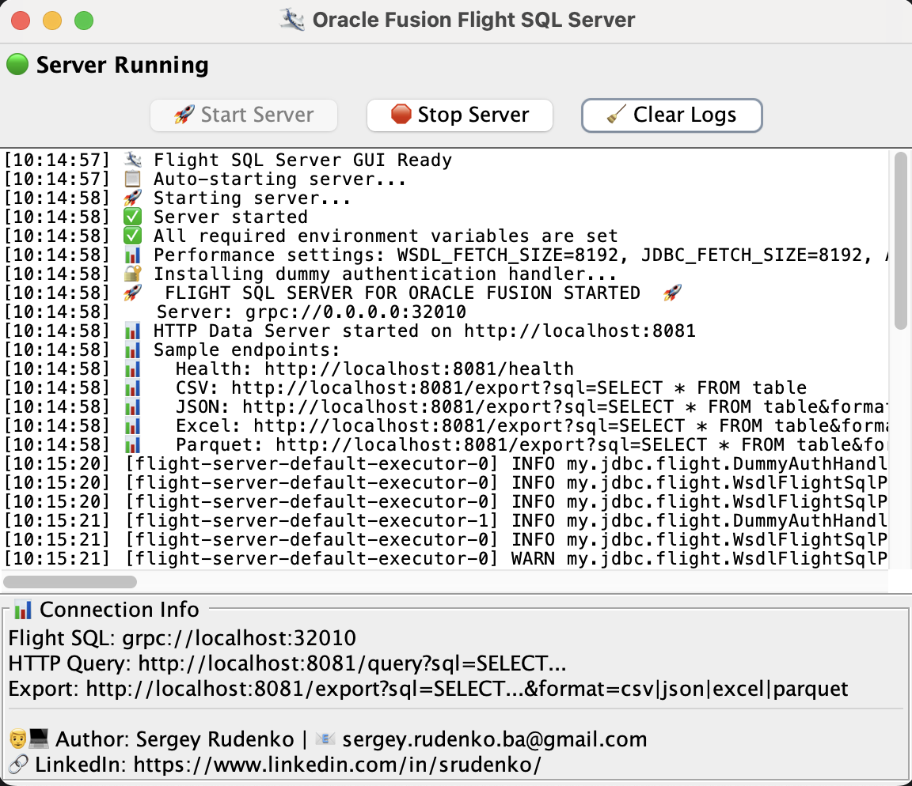

# ✈️ Oracle Fusion Flight SQL Server

**Zero-Infrastructure Data Access for Oracle Fusion** - Just one JAR file!

Transform your Oracle Fusion into a modern data platform with **no servers to manage, no containers to deploy, no infrastructure to maintain**. Simply download one JAR file and instantly unlock:

✨ **Arrow Flight SQL Protocol** - Connect from Python, R, JavaScript, Go, Rust, and more  
🌐 **HTTP REST API** - Export data with simple curl/wget commands  
📊 **Multiple Export Formats** - CSV, JSON, Excel, and Parquet with one click  
⚡ **Streaming Data Access** - Handle datasets with automatic pagination  
🎯 **Zero Configuration** - Works out-of-the-box with your existing Oracle Fusion credentials  

## Why Choose This Over Traditional ETL?

| Traditional ETL | Oracle Fusion Flight SQL |
|---|---|
| Complex infrastructure setup | **Single JAR file** |
| Multiple servers to manage | **Zero infrastructure** |
| Expensive ETL licenses | **Completely free** |
| Vendor lock-in | **Open standards (Arrow Flight SQL)** |
| Limited export formats | **CSV, JSON, Excel, Parquet** |
| Manual data pipeline setup | **Instant API access** |

## 🎯 Well-Suited For

- **Data Scientists** - Direct Python/R access to Oracle Fusion data
- **DevOps Teams** - Simple shell script automation with curl/wget
- **Business Analysts** - One-click Excel exports for reporting
- **Data Engineers** - Parquet exports for data lakes and analytics
- **Integration Teams** - Standards-based API for any programming language
- **ETL Orchestration** - Works seamlessly with Airflow, Prefect, Dagster, and other workflow engines

---

## 📄 Table of Contents

- [✨ Features](#-features)
- [🛠 Prerequisites](#-prerequisites)
- [📝 Installation](#-installation)
- [⚙️ Configuration](#-configuration)
- [❗ Limitations](#-Limitations)
- [⚠️ Important Disclaimer](#-important-disclaimer)
- [📝 TODO](#-todo)
- [📚 Examples](#-examples)
- [🔗 Other ](#-other)
- [📫 Contact](#-contact)

---

## ✨ Features

### 📊 Multi-Format Data Export
- **CSV** - Perfect for spreadsheets and data analysis
- **JSON** - Ideal for web applications and APIs
- **Excel** - Ready-to-use business reports with formatting
- **Parquet** - Optimized columnar format for data lakes and analytics

### ⚡ Optimized Data Access
- **Streaming processing** - Handle datasets with memory efficiency
- **Automatic pagination** - Seamless handling of result sets
- **Connection management** - Efficient resource utilization

### 🌐 Dual Protocol Support
- **Arrow Flight SQL** - Modern binary protocol for efficient data transfer
- **HTTP REST API** - Simple endpoints for curl, wget, and web integration
- **Health monitoring** - Built-in health checks and metrics
- **Cross-platform** - Works on Windows, macOS, and Linux

### 🔒 Enterprise-Ready Security
- **Credential isolation** - Your Oracle Fusion credentials stay secure
- **Read-only access** - Safe for production environments
- **No data storage** - Zero data persistence, pure streaming
- **Standard authentication** - Uses your existing Oracle Fusion login





## 🛠 Prerequisites

Before using this server, ensure you have the following:

- **Oracle Fusion Access:** Valid credentials with access to Oracle Fusion reporting (via WSDL).
- **JDK/JRE:** A Java 17 (or later) runtime installed on your machine.

---

## 📝 Installation & Deployment

### 📦 What You Need


1. **Java 17 or later** installed on your system
2. **Oracle Fusion credentials** with WSDL reporting access
3. **Downloaded files** from the releases section:

   [](https://github.com/krokozyab/ofarrow/releases)

   - `orfujdbc-1.0-SNAPSHOT.jar` (main application)
   - `config.env` (Unix/Linux/macOS configuration template)
   - `config.bat` (Windows configuration template)
   - `startup-gui.sh` (Unix/Linux/macOS GUI launcher)
   - `startup-gui.bat` (Windows GUI launcher)
   - `startup-server.sh` (Unix/Linux/macOS headless launcher)
   - `startup-server.bat` (Windows headless launcher)

### 📁 Directory Structure

Create a dedicated folder and place all files together:
```
oracle-fusion-flight/
├── orfujdbc-1.0-SNAPSHOT.jar    # Main application (REQUIRED)
├── config.env                   # Unix/Linux/macOS config template
├── config.bat                   # Windows config template
├── startup-gui.sh              # Unix/Linux/macOS GUI launcher
├── startup-gui.bat             # Windows GUI launcher
├── startup-server.sh           # Unix/Linux/macOS headless launcher
└── startup-server.bat          # Windows headless launcher
```

### 🔧 Setup Oracle Fusion Report

Create report in OTBI. In your Fusion instance, un-archive DM_ARB.xdm.catalog and RP_ARB.xdo.catalog from [OTBI report](https://github.com/krokozyab/ofjdbc/tree/master/otbireport) into /Shared Folders/Custom/Financials folder. If you already use OFJDBC driver, skip this step.

---

## 🐧 Unix/Linux/macOS Deployment

### Step 1: Make Scripts Executable
```bash
cd oracle-fusion-flight
chmod +x *.sh config.env
```

### Step 2: Configure Oracle Fusion Credentials
```bash
# Copy the configuration template
cp config.env my-config.env

# Edit with your Oracle Fusion details
nano my-config.env  # or vim, gedit, etc.
```

**Edit `my-config.env` with your credentials:**
```bash
#!/bin/bash
# Oracle Fusion Connection Details
export OFJDBC_URL="jdbc:wsdl://your-server.oraclecloud.com/xmlpserver/services/ExternalReportWSSService?WSDL:/Custom/Financials/RP_ARB.xdo"
export OFJDBC_USER="your_username"
export OFJDBC_PASS="your_password"
export FLIGHT_PORT="32010"
export JAVA_TOOL_OPTIONS="--add-opens=java.base/java.nio=org.apache.arrow.memory.core,ALL-UNNAMED"
```

### Step 3: Load Configuration
```bash
source my-config.env
```

### Step 4: Choose Your Mode

#### 🖥️ GUI Mode (Recommended for Desktop)
```bash
./startup-gui.sh
```
- **Best for:** Desktop users, development, testing
- **Features:** Visual interface, easy configuration, auto-start server

#### 💻 Headless Mode (Recommended for Servers)
```bash
./startup-server.sh
```
- **Best for:** Production servers, cloud deployments, automation
- **Features:** No GUI, runs in background, lower resource usage

---

## 🪟 Windows Deployment

### Step 1: Configure Oracle Fusion Credentials
```cmd
# Copy the configuration template
copy config.bat my-config.bat

# Edit with your Oracle Fusion details
notepad my-config.bat
```

**Edit `my-config.bat` with your credentials:**
```batch
@echo off
REM Oracle Fusion Connection Details
set OFJDBC_URL=jdbc:wsdl://your-server.oraclecloud.com/xmlpserver/services/ExternalReportWSSService?WSDL:/Custom/Financials/RP_ARB.xdo
set OFJDBC_USER=your_username
set OFJDBC_PASS=your_password
set FLIGHT_PORT=32010
set JAVA_TOOL_OPTIONS=--add-opens=java.base/java.nio=org.apache.arrow.memory.core,ALL-UNNAMED
```

### Step 2: Load Configuration
```cmd
my-config.bat
```

### Step 3: Choose Your Mode

#### 🖥️ GUI Mode (Recommended for Desktop)
```cmd
startup-gui.bat
```
- **Best for:** Desktop users, development, testing
- **Features:** Visual interface, easy configuration

#### 💻 Headless Mode (Recommended for Servers)
```cmd
startup-server.bat
```
- **Best for:** Production servers, cloud deployments, automation
- **Features:** No GUI, runs in background, lower resource usage
## ⚙️ Usage Examples

### 🐍 Python Data Science
```python
import pyarrow.flight as fl
import pandas as pd

# Connect to Flight SQL server
client = fl.connect("grpc://localhost:32010")
sql = "SELECT * FROM fnd_currencies_tl WHERE rownum <= 10000"

# Get data as Arrow table (efficient format)
table = client.execute(sql).read_all()
df = table.to_pandas()
print(f"Retrieved {len(df)} rows in seconds!")
```

### 📊 Multi-Format Exports
```bash
# Export to Excel for business reports
wget -O report.xlsx "http://localhost:8081/export?sql=SELECT * FROM gl_balances&format=excel"

# Export to Parquet for data lake
curl -o data.parquet "http://localhost:8081/export?sql=SELECT * FROM transactions&format=parquet"

# Export to JSON for web apps
curl "http://localhost:8081/export?sql=SELECT * FROM customers&format=json" | jq .

# Traditional CSV export
wget -O data.csv "http://localhost:8081/export?sql=SELECT * FROM invoices&format=csv"
```

### 🔍 Health Monitoring
```bash
# Check server health
curl http://localhost:8081/health
# Returns: {"status":"UP","database":"UP","uptime_ms":12345,"response_time_ms":45}
```

### 🔄 Apache Airflow Integration
```python
from airflow import DAG
from airflow.operators.python import PythonOperator
from airflow.operators.bash import BashOperator
from datetime import datetime, timedelta
import pyarrow.flight as fl
import pandas as pd

def extract_oracle_fusion_data(**context):
    """Extract data from Oracle Fusion via Flight SQL"""
    client = fl.connect("grpc://localhost:32010")
    sql = "SELECT * FROM gl_balances WHERE period_name = '{{ ds }}'"
    table = client.execute(sql).read_all()
    df = table.to_pandas()
    
    # Save to staging area
    df.to_parquet(f"/data/staging/gl_balances_{{ ds }}.parquet")
    return f"Extracted {len(df)} rows"

dag = DAG(
    'oracle_fusion_etl',
    default_args={
        'owner': 'data-team',
        'retries': 1,
        'retry_delay': timedelta(minutes=5)
    },
    schedule_interval='@daily',
    start_date=datetime(2024, 1, 1),
    catchup=False
)

# Extract task using Flight SQL
extract_task = PythonOperator(
    task_id='extract_fusion_data',
    python_callable=extract_oracle_fusion_data,
    dag=dag
)

# Alternative: Direct HTTP export
export_task = BashOperator(
    task_id='export_to_parquet',
    bash_command='curl -o /data/raw/transactions_{{ ds }}.parquet "http://localhost:8081/export?sql=SELECT * FROM transactions WHERE date = \'{{ ds }}\'&format=parquet"',
    dag=dag
)

# Load to data warehouse
load_task = BashOperator(
    task_id='load_to_warehouse',
    bash_command='python /scripts/load_to_warehouse.py /data/staging/gl_balances_{{ ds }}.parquet',
    dag=dag
)

extract_task >> load_task
```

---

## 🌐 Server Access Points

Once started, the server provides multiple access methods:

### 📊 Data Export Endpoints
```bash
# CSV Export (default)
curl "http://localhost:8081/export?sql=SELECT * FROM fnd_currencies_tl" -o data.csv

# JSON Export
curl "http://localhost:8081/export?sql=SELECT * FROM fnd_currencies_tl&format=json" -o data.json

# Excel Export
wget -O report.xlsx "http://localhost:8081/export?sql=SELECT * FROM fnd_currencies_tl&format=excel"

# Parquet Export
curl "http://localhost:8081/export?sql=SELECT * FROM fnd_currencies_tl&format=parquet" -o data.parquet
```

### ⚡ Arrow Flight SQL (Python)
```python
import pyarrow.flight as fl
client = fl.connect("grpc://localhost:32010")
table = client.execute("SELECT * FROM fnd_currencies_tl").read_all()
df = table.to_pandas()
```

## 🔧 Troubleshooting

### ❌ "Java not found"
```bash
# Install Java 17+ on Ubuntu/Debian
sudo apt update && sudo apt install openjdk-17-jdk

# Install Java 17+ on macOS
brew install openjdk@17

# Install Java 17+ on Windows
# Download from: https://adoptium.net/
```

### ❌ "JAR file not found"
- Ensure `orfujdbc-1.0-SNAPSHOT.jar` is in the same directory as startup scripts
- Check filename matches exactly (case-sensitive on Unix/Linux)

### ❌ "Oracle Fusion credentials not found"
- Run `source my-config.env` (Unix/Linux/macOS) or `my-config.bat` (Windows)
- Verify your credentials are correct in the config file

### ❌ "Permission denied" (Unix/Linux/macOS)
```bash
chmod +x startup-gui.sh startup-server.sh config.env
```

---

## 📋 Quick Start Checklist

- [ ] Java 17+ installed
- [ ] All files in same directory
- [ ] Scripts made executable (Unix/Linux/macOS)
- [ ] Configuration file edited with credentials
- [ ] Configuration loaded (`source` or run `.bat`)
- [ ] Startup script executed
- [ ] Health check successful: `curl http://localhost:8081/health`

**You're ready to query Oracle Fusion data!** 🎉

---

## ❗ Limitations

- Read-only access to Oracle Fusion data
- Requires Oracle Fusion WSDL reporting setup
- Limited to SQL SELECT statements
- Some limitations are inherent to the underlying Oracle Fusion reporting architecture.
  For further insights on some of these challenges, see this article on using synchronous BIP for data extraction.
  https://www.ateam-oracle.com/post/using-synchronous-bip-for-extracting-data-dont


## ⚠️ Important Disclaimer

Consult with your organization's security team before deployment. Ensure compliance with your security policies and standards.


## 🎆 What Makes This Special

### 📦 Single JAR Deployment
- **No Docker containers** - Just run `java -jar`
- **No Kubernetes clusters** - Works on any machine with Java
- **No database servers** - Direct connection to Oracle Fusion
- **No configuration files** - Environment variables only

### 🚀 Efficiently Designed
- **Streaming architecture** - Handle datasets with memory efficiency
- **Columnar formats** - Parquet exports are more compact than CSV
- **Connection reuse** - Efficient resource management

### 🌍 Universal Compatibility
- **Any programming language** - Arrow Flight SQL clients everywhere
- **Any operating system** - Windows, macOS, Linux
- **Any deployment** - Local dev, cloud VMs, containers (optional)
- **Any data tool** - Python, R, Tableau, Power BI, Excel

## 📝 Roadmap

- ✅ **Multi-format exports** (CSV, JSON, Excel, Parquet)
- ✅ **Health monitoring** and metrics
- ✅ **Performance optimization** (8K row batches)
- 🔄 **Query caching** for repeated requests
- 🔄 **Metrics dashboard** for monitoring
- 🔄 **SSL/TLS support** for secure connections

## 📚 Real-World Examples

### 🐍 Python Data Pipeline
```python
# ETL Pipeline with Polars (Efficient Processing)
import polars as pl
import pyarrow.flight as fl

client = fl.connect("grpc://localhost:32010")

# Extract large dataset
sql = "SELECT * FROM gl_balances WHERE period_name = '2024-01'"
table = client.execute(sql).read_all()

# Transform with Polars
df = pl.from_arrow(table)
result = df.group_by("account_code").agg(pl.col("amount").sum())

# Load to Parquet
result.write_parquet("monthly_balances.parquet")
```

### 📊 Business Intelligence
```bash
#!/bin/bash
# Daily reporting automation

# Export financial data to Excel
wget -O "daily_report_$(date +%Y%m%d).xlsx" \
  "http://localhost:8081/export?sql=SELECT * FROM daily_summary&format=excel"

# Upload to cloud storage
aws s3 cp daily_report_*.xlsx s3://reports-bucket/
```

### 🔄 Data Lake Integration
```bash
# Bulk export to data lake
for table in customers invoices payments; do
  curl -o "${table}.parquet" \
    "http://localhost:8081/export?sql=SELECT * FROM ${table}&format=parquet"
  
  # Upload to data lake
  hdfs dfs -put "${table}.parquet" /data/oracle_fusion/
done
```

### 🌐 Web Application Integration
```javascript
// Fetch data for web dashboard
fetch('http://localhost:8081/export?sql=SELECT * FROM kpis&format=json')
  .then(response => response.json())
  .then(data => {
    // Render charts and dashboards
    renderDashboard(data);
  });
```

## 🔗 Other

- **Root Project:** [ofjdbc - Oracle Fusion JDBC Driver](https://github.com/krokozyab/ofjdbc)

## 📫 Contact

For questions or issues, reach out via GitHub Issues or [sergey.rudenko.ba@gmail.com](mailto:sergey.rudenko.ba@gmail.com).
