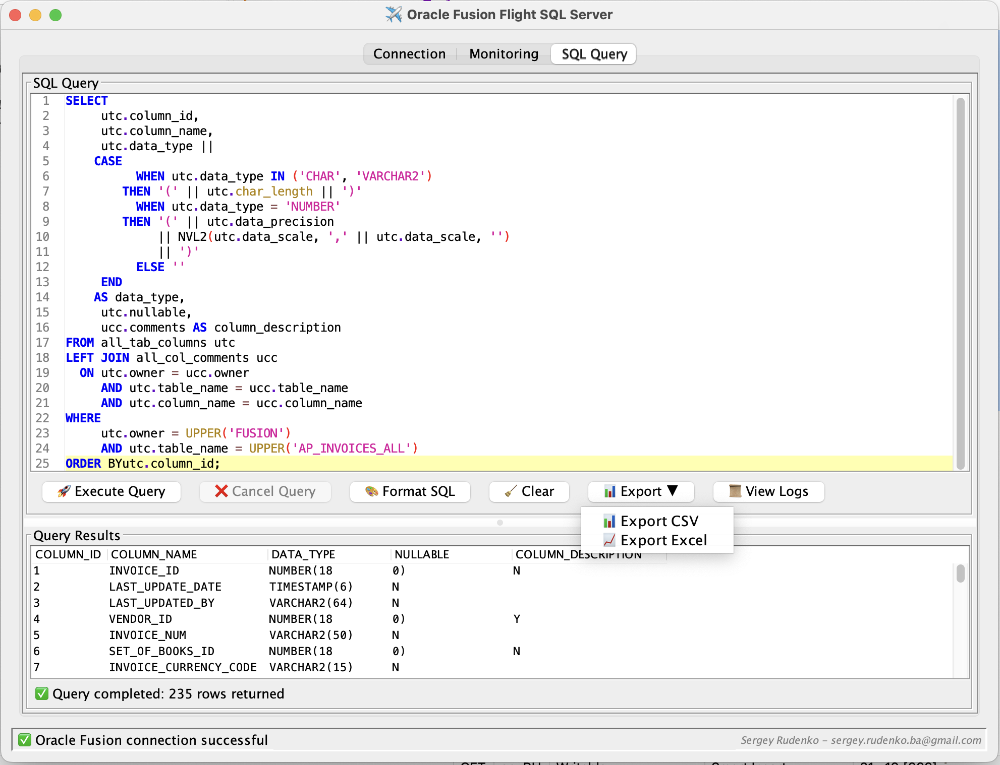
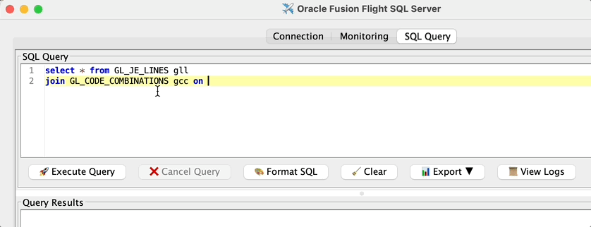

# ✈️ Oracle Fusion Flight SQL Server

**Zero-Infrastructure Data Access for Oracle Fusion**

Transform your Oracle Fusion into a modern data platform with **no servers to manage, no containers to deploy, no infrastructure to maintain**. Download the Windows or macOS installer and start using the app instantly:

🖥️ **Built-in SQL Editor & Export** - Execute ad-hoc SQL queries using the integrated editor with syntax highlightings, autocompletion and result previews, export results directly to CSV or Excel with one click.   
✨ **Arrow Flight SQL Protocol** - Connect from Python, R, JavaScript, Go, Rust, and more  
🌐 **HTTP REST API** - Export data with simple curl/wget commands  
📊 **Multiple Export Formats** - CSV, JSON, Excel, and Parquet with hive support  
⚡ **Streaming Data Access** - Handle datasets with automatic pagination   
🎯 **Minimal Configuration** - Just unarchive OTBI report and provide credentials  

## Why Choose This Over Traditional ETL?

| Traditional ETL              | Oracle Fusion Flight SQL              |
|------------------------------|---------------------------------------|
| Complex infrastructure setup | **Windows & macOS installers**        |
| Multiple servers to manage   | **Zero infrastructure**               |
| Expensive ETL licenses       | **Completely free**                   |
| Vendor lock-in               | **Open standards (Arrow Flight SQL)** |
| Limited export formats       | **CSV, JSON, Excel, Parquet, Hive**   |
| Manual data pipeline setup   | **Instant API access**                |

## 🎯 Well-Suited For

- **Data Scientists** - Direct Python/R access to Oracle Fusion data
- **DevOps Teams** - Simple shell script automation with curl/wget
- **Business Analysts** - One-click Excel exports for reporting
- **Data Engineers** - Parquet exports for data lakes and analytics
- **Integration Teams** - Standards-based API for any programming language
- **ETL Orchestration** - Works seamlessly with Airflow, Prefect, Dagster, and other workflow engines

---

## 📄 Table of Contents

- [✨ Features](#-features)
- [🛠 Prerequisites](#-prerequisites)
- [📝 Installation](#-installation)
- [⚙️ Configuration](#-configuration)
- [❗ Limitations](#-Limitations)
- [⚠️ Important Disclaimer](#-important-disclaimer)
- [📝 TODO](#-todo)
- [📚 Examples](#-examples)
- [🔗 Other ](#-other)
- [📫 Contact](#-contact)

---

## ✨ Features

### 📊 Multi-Format Data Export
- **CSV** - Perfect for spreadsheets and data analysis
- **JSON** - Ideal for web applications and APIs
- **Excel** - Ready-to-use business reports with formatting
- **Parquet** - Optimized columnar format for data lakes and analytics
- **Hive Partitioned** - Partitioned Parquet files in ZIP archive for data lakes

### ⚡ Optimized Data Access
- **Streaming processing** - Handle datasets with memory efficiency
- **Automatic pagination** - Seamless handling of result sets
- **Connection management** - Efficient resource utilization

### 🌐 Dual Protocol Support
- **Arrow Flight SQL** - Modern binary protocol for efficient data transfer
- **HTTP REST API** - Simple endpoints for curl, wget, and web integration
- **Health monitoring** - Built-in health checks and metrics
- **Cross-platform** - Works on Windows and macOS







## 🛠 Prerequisites

Before using this server, ensure you have the following:

- **Oracle Fusion Access:** Valid credentials with access to Oracle Fusion reporting.

---

## 📝 Installation & Deployment

### 📦 What You Need

1  **Oracle Fusion credentials** with WSDL reporting access
2  **Downloaded** oracle-fusion-flight-release.zip file from the latest release:

**You're ready to query Oracle Fusion data!** 🎉

   [](https://github.com/krokozyab/ofarrow/releases)


### 🔧 Setup Oracle Fusion Report

1. Create report in OTBI. In your Fusion instance, un-archive DM_ARB.xdm.catalog and RP_ARB.xdo.catalog from [OTBI report](https://github.com/krokozyab/ofarrow/tree/master/otbi) into /Shared Folders/Custom/Financials folder.
2. Install the application by downloading the appropriate installer from the Releases page—available for both Windows and macOS.

## ⚙️ Usage Examples

[### 🐍 Python Data Science](https://gist.github.com/krokozyab/f20b868d4b9c2a1ba12a52e1ada1a07d)

[### 📊 Multi-Format Exports](https://gist.github.com/krokozyab/92e6c977bd3f593f7d39a678a52a57a1)


### 🔍 Health Monitoring
```bash
# Check server health
curl http://localhost:8081/health
# Returns: {"status":"UP","database":"UP","uptime_ms":12345,"response_time_ms":45}
```

[### 🔄 Apache Airflow Integration](https://gist.github.com/krokozyab/69f880e78ca4654faba021c304d48eb0)


### 🗂 Hive Partitioned Export
```bash
# Export data partitioned by a specific column (returns ZIP archive)
curl -G -o gl_partitioned.zip \
  --data-urlencode "sql=SELECT segment1, segment2, segment3, concatenated_segments FROM gl_code_combinations" \
  --data-urlencode "format=hive" \
  --data-urlencode "partition=segment3" \
  "http://localhost:8081/export"
# Extract to see Hive-style directory structure
unzip gl_partitioned.zip
ls -la

```

** Suited for:**
- 🏢 **Data Lakes** - Hive-compatible partitioned structure
- ⚡ **Query Performance** - Partition pruning for faster analytics
- 📁 **Data Organization** - Logical data separation by column values
- 🔄 **ETL Pipelines** - Standard format for Spark, Hive, Presto

---

## 🌐 Server Access Points

Once started, the server provides multiple access methods:

### 📊 Data Export Endpoints
```bash
# CSV Export (default)
curl "http://localhost:8081/export?sql=SELECT * FROM fnd_currencies_tl" -o data.csv

# JSON Export
curl "http://localhost:8081/export?sql=SELECT * FROM fnd_currencies_tl&format=json" -o data.json

# Excel Export
wget -O report.xlsx "http://localhost:8081/export?sql=SELECT * FROM fnd_currencies_tl&format=excel"

# Parquet Export
curl "http://localhost:8081/export?sql=SELECT * FROM fnd_currencies_tl&format=parquet" -o data.parquet

# Hive Partitioned Export (ZIP archive)
curl -o partitioned.zip "http://localhost:8081/export?sql=SELECT * FROM fnd_currencies_tl&format=hive&partition=currency_code"
```

### ⚡ Arrow Flight SQL (Python)
```python
import pyarrow.flight as fl
client = fl.connect("grpc://localhost:32010")
table = client.execute("SELECT * FROM fnd_currencies_tl").read_all()
df = table.to_pandas()
```

---

## ❗ Limitations

- Read-only access to Oracle Fusion data
- Requires Oracle Fusion WSDL reporting setup
- Limited to SQL SELECT statements
- Some limitations are inherent to the underlying Oracle Fusion reporting architecture.
  For further insights on some of these challenges, see this article on using synchronous BIP for data extraction.
  https://www.ateam-oracle.com/post/using-synchronous-bip-for-extracting-data-dont


## ⚠️ Important Disclaimer

Consult with your organization's security team before deployment. Ensure compliance with your security policies and standards.


## 🎆 What Makes This Special

### 📦 Single JAR Deployment
- **No Docker containers** - Installers provided`
- **No Kubernetes clusters** - Works on any machine with Java
- **No database servers** - Direct connection to Oracle Fusion
- **No configuration files** 

### 🚀 Efficiently Designed
- **Streaming architecture** - Handle datasets with memory efficiency
- **Columnar formats** - Parquet exports are more compact than CSV
- **Connection reuse** - Efficient resource management

### 🌍 Universal Compatibility
- **Any programming language** - Arrow Flight SQL clients everywhere
- **Any operating system** - Windows, macOS, Linux
- **Any deployment** - Local dev, cloud VMs, containers (optional)
- **Any data tool** - Python, R, Tableau, Power BI, Excel

## 📝 Roadmap

- ✅ **Multi-format exports** (CSV, JSON, Excel, Parquet)
- 🔄 **Query caching** for repeated requests
- 🔄 **SSL/TLS support** for secure connections

## 📚 Real-World Examples

### 🐍 Python Data Pipeline
```python
# ETL Pipeline with Polars (Efficient Processing)
import polars as pl
import pyarrow.flight as fl

client = fl.connect("grpc://localhost:32010")

# Extract large dataset
sql = "SELECT * FROM gl_balances WHERE period_name = '2024-01'"
table = client.execute(sql).read_all()

# Transform with Polars
df = pl.from_arrow(table)
result = df.group_by("account_code").agg(pl.col("amount").sum())

# Load to Parquet
result.write_parquet("monthly_balances.parquet")
```

### 📊 Business Intelligence
```bash
#!/bin/bash
# Daily reporting automation

# Export financial data to Excel
wget -O "daily_report_$(date +%Y%m%d).xlsx" \
  "http://localhost:8081/export?sql=SELECT * FROM daily_summary&format=excel"

# Upload to cloud storage
aws s3 cp daily_report_*.xlsx s3://reports-bucket/
```

### 🔄 Data Lake Integration
```bash
# Bulk export to data lake with Hive partitioning
for table in customers invoices payments; do
  # Export with partitioning for better query performance
  curl -o "${table}_partitioned.zip" \
    "http://localhost:8081/export?sql=SELECT * FROM ${table}&format=hive&partition=region"
  
  # Extract and upload partitioned structure
  unzip "${table}_partitioned.zip" -d "${table}_data/"
  hdfs dfs -put "${table}_data/" /data/oracle_fusion/
done
```

### 🌐 Web Application Integration
```javascript
// Fetch data for web dashboard
fetch('http://localhost:8081/export?sql=SELECT * FROM kpis&format=json')
  .then(response => response.json())
  .then(data => {
    // Render charts and dashboards
    renderDashboard(data);
  });
```

### 🔍 Find Outliers in Accounting Entries
```python
import pyarrow.flight as fl
import pyarrow as pa
import polars as pl
from sklearn.ensemble import IsolationForest
from sklearn.preprocessing import LabelEncoder
import numpy as np

client = fl.FlightClient("grpc://localhost:32010")
sql = """SELECT
  gjh.JE_SOURCE,
  gjh.JE_CATEGORY,
  gjh.JE_FROM_SLA_FLAG,
  gli.CREATED_BY,
  gli.ACCOUNTED_DR,
  gli.ACCOUNTED_CR,
  gli.DESCRIPTION,
  gcc.SEGMENT1,
  gcc.SEGMENT2,
  gcc.SEGMENT3,
  gcc.SEGMENT4,
  gcc.SEGMENT5,
  gcc.SEGMENT6,
  gcc.SEGMENT7
FROM gl_je_lines gli
JOIN GL_JE_HEADERS gjh
  ON gli.JE_HEADER_ID = gjh.JE_HEADER_ID
JOIN GL_CODE_COMBINATIONS gcc
  ON gli.CODE_COMBINATION_ID = gcc.CODE_COMBINATION_ID
WHERE
  gli.PERIOD_NAME in ('Jan-25','Feb-25')"""
descriptor = fl.FlightDescriptor.for_command(sql.encode("utf-8"))

flight_info = client.get_flight_info(descriptor)
reader = client.do_get(flight_info.endpoints[0].ticket)

chunks = []
for chunk in reader:
    record_batch = chunk.data
    print("🔄 Received batch:", record_batch.num_rows)
    chunks.append(record_batch)

# Combine all data
table = pa.Table.from_batches(chunks)
df = pl.from_arrow(table)

# Convert numeric columns
df = df.with_columns([
    pl.col("ACCOUNTED_DR").str.replace("", "0").cast(pl.Float64, strict=False).fill_null(0).alias("ACCOUNTED_DR"),
    pl.col("ACCOUNTED_CR").str.replace("", "0").cast(pl.Float64, strict=False).fill_null(0).alias("ACCOUNTED_CR")
])

# Prepare all features for Random Cut Forest
feature_data = []

# Numeric features
feature_data.append(df["ACCOUNTED_DR"].to_numpy())
feature_data.append(df["ACCOUNTED_CR"].to_numpy())

# Encode categorical features
for col in ["JE_SOURCE", "JE_CATEGORY", "JE_FROM_SLA_FLAG", "CREATED_BY", "SEGMENT1", "SEGMENT2", "SEGMENT3", "SEGMENT4", "SEGMENT5", "SEGMENT6", "SEGMENT7"]:
    if col in df.columns:
        le = LabelEncoder()
        encoded = le.fit_transform(df[col].fill_null("NULL").to_numpy())
        feature_data.append(encoded)

features = np.column_stack(feature_data)

# Apply Random Cut Forest to entire dataset with very low contamination
iso_forest = IsolationForest(contamination=3/len(df), random_state=42)
outlier_labels = iso_forest.fit_predict(features)

# Get top 3 most anomalous records
scores = iso_forest.decision_function(features)
top_outlier_indices = np.argsort(scores)[:3]

outliers_df = df[top_outlier_indices]
if outliers_df.height > 0:
    outliers_df.write_csv("outliers.csv")
    print(f"📝 Written {outliers_df.height} outliers to outliers.csv")

print("✅ Total rows:", len(df))
```

## 🔗 Other

- **Root Project:** [ofjdbc - Oracle Fusion JDBC Driver](https://github.com/krokozyab/ofjdbc)

- **Further reading:** Check out this article on Medium:  
  [Simplifying Oracle Fusion Data Access with ofarrow](https://medium.com/@rudenko.s/simplifying-oracle-fusion-data-access-with-ofarrow-a78f59a18b12)


## 📫 Contact

For questions or issues, reach out via GitHub Issues or [sergey.rudenko.ba@gmail.com](mailto:sergey.rudenko.ba@gmail.com).
